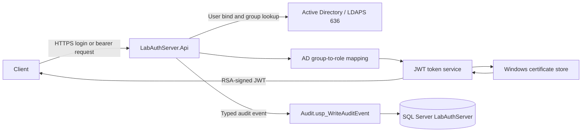
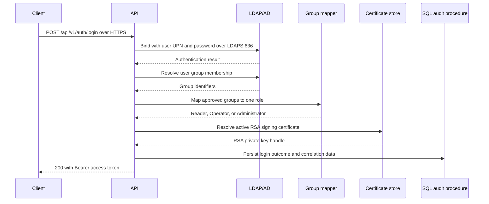

# LabAuthServer

LabAuthServer is a versioned ASP.NET Core API that authenticates users against Microsoft Active Directory over LDAPS, maps approved directory groups to application roles, issues RSA-signed JWT bearer tokens, and protects API resources with policy-based authorization.

## Overview

The service is intended for Windows-hosted applications that need centralized Active Directory authentication without storing user passwords. A successful HTTPS login performs a user bind over LDAPS, resolves the user’s directory groups, selects an approved application role, signs a short-lived access token with an RSA certificate from the Windows certificate store, and records approved security events in SQL Server.

The current API has one public health endpoint, one public login endpoint, and one Reader-protected resource. It is deliberately not a user store and does not implement refresh tokens, sessions, MFA, federation, or password persistence.

## Key Features

- ASP.NET Core and C# on .NET 10.
- HTTPS-enforced login and HTTPS redirection.
- LDAPv3 authentication over LDAPS on TCP port 636.
- Windows DPAPI LocalMachine protection for the LDAP service-account password file.
- Active Directory group lookup with LDAP filter escaping.
- Explicit, validated group-to-role mappings with fail-closed behavior.
- JWT bearer authentication with issuer, audience, lifetime, algorithm, `kid`, and required-claim validation.
- RSA certificate-store signing; private key material is not stored in the repository.
- Default authenticated-user policy plus Reader, Operator, and Administrator policies.
- Correlation IDs returned in `X-Correlation-ID` and included in audit records.
- SQL Server audit persistence through a typed stored-procedure boundary.
- Centralized, generic `ProblemDetails` responses for unhandled errors.
- Unit and ASP.NET Core integration tests.
- File-system publish configuration for IIS deployment.
- A signed, offline license document that carries commercial entitlement (edition, features, limits, validity window); see [Licensing](docs/Licensing.md). Runtime licensing is wired into startup: the license is loaded and validated at startup, and a missing or invalid license produces restricted Community behavior. Replacement currently requires restart/reload.

## Licensing and Source Availability

> DRAFT POLICY NOTICE — REQUIRES PROFESSIONAL LEGAL REVIEW

LabAuthServer is proprietary software. Source availability does not mean that the project is open source. The repository remains private and controlled for vendor-approved evaluation and review; no public source release is authorized.

Production, live, customer-facing, or commercial use requires vendor authorization and an appropriate vendor-issued signed commercial license. Source access does not itself grant modification, redistribution, derivative-work, or commercial-use rights. Use the vendor process for evaluation access and production licensing: `<COMMERCIAL_CONTACT>`.

Phase 4 technical licensing remains offline-first. The application validates signed entitlements at startup and does not provide online activation or revocation. A party controlling source, build, and host can technically modify an unofficial build; the system does not claim unbreakable DRM. See [Evaluation Use](docs/Evaluation-Use.md), [Commercial Licensing](docs/Commercial-Licensing.md), and [Licensing](docs/Licensing.md).

## Architecture



The solution follows four layers:

| Layer | Responsibility |
| --- | --- |
| `LabAuthServer.Domain` | Domain-level constants and rules. |
| `LabAuthServer.Application` | DTOs, interfaces, roles, policies, token orchestration, and audit contracts. |
| `LabAuthServer.Infrastructure` | LDAP/AD, DPAPI, group mapping, JWT signing/validation support, and SQL audit integration. |
| `LabAuthServer.Api` | HTTP endpoints, dependency injection, authentication/authorization middleware, correlation, and error handling. |

## Authentication Flow



Invalid credentials, invalid requests, directory failures, timeouts, and unexpected failures are mapped to safe HTTP responses. Passwords, tokens, private keys, and raw directory responses are not logged or persisted by the application.

## Authorization Model

Authorization is fail-closed. The default policy requires an authenticated JWT. Public endpoints are limited by configuration to health and login; the protected controller requires the `RequireReader` policy.

| Active Directory group | Application role |
| --- | --- |
| `GG-APP-ADMIN` | `Administrator` |
| `GG-APP-APPROVER` | `Operator` |
| `GG-APP-USER` | `Reader` |
| `GG-APP-REPORT` | `Reader` |

When several approved groups are present, the implemented precedence is `Administrator` > `Operator` > `Reader`. The login flow places only the highest-precedence role in the token. Unknown or malformed groups do not grant access, and an empty mapped role set cannot produce a token.

## Token and JWT Security

The repository’s non-secret configuration uses the following model. Replace deployment-specific values with approved environment values; do not publish certificate thumbprints or key material.

| Setting | Implemented behavior |
| --- | --- |
| Algorithm | `RS256` in the supplied configuration; the validator permits only the configured approved RSA-compatible algorithm. |
| Issuer | Required absolute HTTPS URI, for example `<ISSUER_HTTPS_URI>`. |
| Audience | Required configured audience, for example `<AUDIENCE>`. |
| Lifetime | One hour in the supplied configuration; validator maximum is one day. |
| Clock skew | Five minutes in the supplied configuration; validator maximum is five minutes. |
| Key identifier | `kid` is required and must identify the active or valid previous approved key. |
| Key storage | RSA private key is resolved from the Windows certificate store using a configured store location, store name, and thumbprint placeholder such as `<THUMBPRINT>`. |
| Claims | `iss`, `aud`, `sub`, `jti`, `iat`, `nbf`, `exp`, one `role`, and `scope`. |
| Size limits | Maximum claim size `4096` bytes and maximum token size `16384` bytes in the supplied configuration. |

Inbound claim mapping is disabled. Tokens must be signed, must contain exactly one approved role, and are rejected for invalid issuer, audience, lifetime, signature, key identifier, or required claims. The implementation supports an approved previous-key overlap when configured; it does not store refresh tokens or signing keys in the repository.

## Active Directory / LDAP Integration

The API uses `System.DirectoryServices.Protocols` with LDAPv3 and secure sockets. Production validation requires LDAPS and TCP port 636. The submitted username must be a UPN in the configured domain; the implementation does not fall back to DN binding or anonymous binding.

The `ActiveDirectory` section contains the domain, host, base DN, user search base DN, service-account username, protected password-file path, LDAPS flag, and connection timeout. The supplied configuration uses a ten-second timeout. The service-account password is loaded from a Windows DPAPI LocalMachine-protected file such as `<DPAPI_SECRET_FILE>` and is not represented in this README.

The runtime identity must be able to read and decrypt that file, and the server must trust the directory certificate through normal platform certificate validation. Configuration is validated at startup; invalid production LDAP settings fail closed.

## Audit Logging

Audit writes use `SqlAuditEventService` and the stored procedure `Audit.usp_WriteAuditEvent`; the application does not write directly to audit tables or build dynamic SQL. The database scripts create:

- `Reference.EventTypes`, containing the controlled event vocabulary.
- `Audit.AuditEvents`, containing correlation, request, identity, role, endpoint, status, outcome, host, version, and bounded details fields.
- `Audit.usp_WriteAuditEvent`, which validates event data, rejects prohibited sensitive JSON properties, resolves enabled event types, and writes one event transactionally.
- `LabAuthServer_AuditWriter`, with execute permission on the audit procedure for the configured IIS application-pool identity.

Audited categories include successful and failed login, LDAP failure, authorization granted/denied, invalid or expired tokens, invalid signature/issuer/audience/role, validation errors, and unhandled exceptions. Audit persistence failures are logged safely and do not replace the primary HTTP response. Retention, purge, archival, and SQL Agent scheduling are not implemented in these scripts.

## API Endpoints

### Public endpoints

| Method | Endpoint | Authentication | Description |
| --- | --- | --- | --- |
| `GET` | `/api/v1/health` | Anonymous | Returns `200` with `{"status":"Healthy"}`. |
| `POST` | `/api/v1/auth/login` | Anonymous, HTTPS required | Authenticates a configured-domain UPN and returns a bearer token on success. |

Login request shape:

```json
{
	"username": "<USERNAME>@<DOMAIN>",
	"password": "<PASSWORD>"
}
```

Successful responses contain `accessToken`, `tokenType` (`Bearer`), and `expiresAt`. Depending on the failure category, login returns `400`, `401`, `499`, `500`, `503`, or `504` with a safe `ProblemDetails` response. Do not put real credentials in scripts, examples, issue reports, or logs.

### Protected endpoints

| Method | Endpoint | Authentication | Description |
| --- | --- | --- | --- |
| `GET` | `/api/v1/protected` | Bearer JWT with `Reader` role | Returns a protected-resource response and records an access-granted audit event. |

Anonymous or invalid-token requests receive `401`; an authenticated request that does not satisfy the Reader policy receives `403` and is audited as access denied.

## Health Checks

`GET /api/v1/health` is an anonymous application liveness endpoint. It returns a typed healthy response and participates in correlation middleware. It does not claim to validate LDAP, SQL Server, or certificate-store availability.

## Configuration

Configuration is bound and validated on startup from these sections:

- `ActiveDirectory`: directory host/domain, distinguished names, LDAPS, timeout, service-account username, and DPAPI file path.
- `Token`: HTTPS issuer, audience, lifetime, clock skew, algorithm, key identifiers, certificate-store reference, and size limits.
- `Authorization`: explicit default-deny setting, group-count limit, public endpoint allowlist, and group-to-role mappings.
- `Audit`: SQL Server connection string and stored-procedure command timeout.

Use environment-specific configuration or an approved secret-management process for `<CONNECTION_STRING>`, `<USERNAME>`, `<DPAPI_SECRET_FILE>`, `<THUMBPRINT>`, and certificate-store access. The repository’s sample settings contain lab-specific values and must not be treated as production-safe defaults.

## Getting Started

### Prerequisites

- Windows for the implemented DPAPI credential provider, Windows certificate store, and IIS deployment model.
- .NET SDK `10.0.400` or a compatible SDK permitted by `global.json`.
- A reachable AD/LDAP environment configured for LDAPS on TCP 636.
- An approved RSA certificate with an accessible private key in the configured certificate store.
- SQL Server with the database objects in `database/Phase11` applied when audit persistence is enabled.

### Restore, build, and test

From the repository root:

```powershell
dotnet restore .\LabAuthServer.slnx
dotnet build .\LabAuthServer.slnx -c Release --no-restore --nologo
dotnet test .\LabAuthServer.slnx -c Release --no-build --nologo
```

The unit suite isolates application and infrastructure seams. The integration suite exercises the ASP.NET Core request pipeline and selected infrastructure boundaries, including SQL audit behavior. Live AD credentials, private keys, and DPAPI contents are environment-bound and are not required to be placed in the repository.

### Run locally

The API project includes HTTP and HTTPS launch profiles. Use the HTTPS profile after supplying valid local configuration and protected dependencies:

```powershell
dotnet run --project .\src\LabAuthServer.Api\LabAuthServer.Api.csproj --launch-profile https
```

The checked-in development profile binds HTTPS to `https://localhost:7068` and HTTP to `http://localhost:5269`; the application redirects HTTP requests to HTTPS.

### Publish

The API includes a file-system publish profile that targets `Build\Release`:

```powershell
dotnet publish .\src\LabAuthServer.Api\LabAuthServer.Api.csproj -c Release -p:PublishProfile=FolderProfile
```

For IIS deployment and rollback, use the repository’s operational documentation and the approved deployment script available in the deployment environment. Do not copy secrets, private keys, PDBs, or development configuration into a release package.

## Database Setup

Apply the SQL scripts in order with an authorized SQL Server identity:

1. `database/Phase11/01_CreateDatabase.sql`
2. `database/Phase11/02_CreateSchemasTables.sql`
3. `database/Phase11/03_CreateAuditProcedures.sql`
4. `database/Phase11/04_ConfigureAuditPermissions.sql`

The final script grants procedure execution to the configured IIS application-pool principal. Review and adapt the principal, connection string, and transport settings for the target environment; the README intentionally uses placeholders and does not publish infrastructure credentials.

## Project Structure

```text
LabAuthServer/
├── .github/
│   └── copilot-instructions.md
├── database/
│   └── Phase11/
│       ├── 01_CreateDatabase.sql
│       ├── 02_CreateSchemasTables.sql
│       ├── 03_CreateAuditProcedures.sql
│       └── 04_ConfigureAuditPermissions.sql
├── docs/
│   ├── Architecture.md
│   ├── Authentication.md
│   ├── Authorization.md
│   ├── AuditLogging.md
│   ├── Configuration.md
│   ├── Database.md
│   ├── Deployment.md
│   ├── JWT.md
│   ├── Operations.md
│   ├── Security.md
│   ├── Testing.md
│   ├── Troubleshooting.md
│   ├── Validation_Status.md
│   └── archive/
├── src/
│   ├── LabAuthServer.Api/
│   ├── LabAuthServer.Application/
│   ├── LabAuthServer.Domain/
│   └── LabAuthServer.Infrastructure/
├── tests/
│   ├── LabAuthServer.UnitTests/
│   └── LabAuthServer.IntegrationTests/
├── Directory.Build.props
├── global.json
├── LabAuthServer.slnx
├── NuGet.Config
└── README.md
```

## Documentation

- [Architecture](docs/Architecture.md)
- [Authentication](docs/Authentication.md)
- [Authorization](docs/Authorization.md)
- [JWT](docs/JWT.md)
- [Audit logging](docs/AuditLogging.md)
- [Configuration](docs/Configuration.md)
- [Database](docs/Database.md)
- [Deployment](docs/Deployment.md)
- [Safe deployment procedure](docs/Safe_Deployment_Procedure.md)
- [Operations](docs/Operations.md)
- [Security](docs/Security.md)
- [Testing](docs/Testing.md)
- [Troubleshooting](docs/Troubleshooting.md)
- [Validation status](docs/Validation_Status.md)
- [Historical documentation archive](docs/archive/README.md)

## Security and validation notes

No passwords, access tokens, private keys, or DPAPI secret contents belong in source control. The repository includes security-focused tests and documentation, but live directory authentication and certificate/DPAPI behavior depend on protected infrastructure. Review [Validation Status](docs/Validation_Status.md) for the authoritative evidence boundary; historical phase records are preserved under `docs/archive/`.
