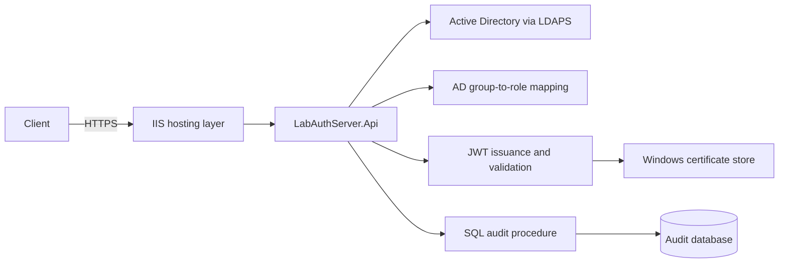

# Architecture

LabAuthServer is a four-layer ASP.NET Core API for Active Directory authentication, JWT issuance, role-based authorization, and SQL audit persistence.

## Layers

- `LabAuthServer.Domain` contains domain-level constants and rules.
- `LabAuthServer.Application` contains DTOs, interfaces, token orchestration, roles, policies, and audit contracts.
- `LabAuthServer.Infrastructure` contains LDAP/AD, DPAPI, group mapping, signing-key, and SQL implementations.
- `LabAuthServer.Api` contains controllers, dependency injection, middleware, authentication, authorization, and endpoint composition.

The dependency direction is `Domain <- Application <- Infrastructure <- Api`.

## Request pipeline

`Program.cs` registers ProblemDetails, controllers, validated Active Directory options, validated token and authorization options, SQL audit services, and middleware. Requests pass through global exception handling, correlation, HTTPS redirection, JWT authentication, authorization auditing, and authorization.

The current API surface is:

- `GET /api/v1/health` — anonymous application liveness response.
- `POST /api/v1/auth/login` — anonymous HTTPS-only login and token issuance.
- `GET /api/v1/protected` — Reader-policy protected resource.

## External boundaries

- Active Directory is accessed with LDAPv3 over LDAPS on TCP 636.
- LDAP service-account credentials are loaded through the Windows DPAPI-backed provider.
- JWT signing uses an RSA certificate from the configured Windows certificate store.
- Audit events are written through `Audit.usp_WriteAuditEvent` using typed SQL parameters.

No refresh-token store, user database, MFA provider, federation provider, or audit-retention job is implemented.
