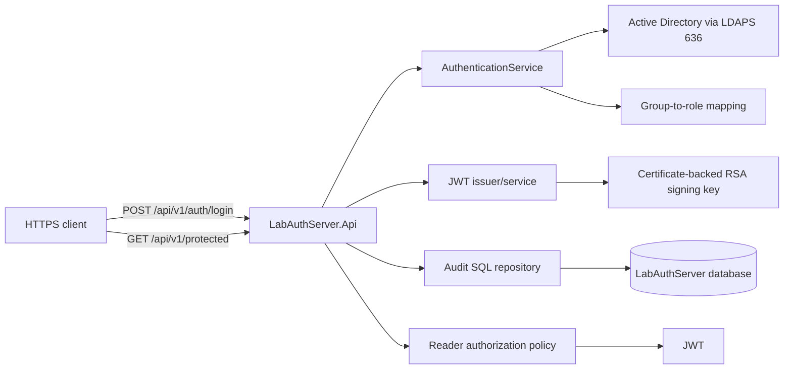

# Architecture

## Overview

LabAuthServer is a secured authentication and authorization API for Windows Active Directory environments. The service authenticates users through LDAPS, maps approved AD groups to application roles, issues a signed JWT access token, and enforces Role-based authorization on protected resources.

The implementation is organized in the approved four-layer architecture:

- `LabAuthServer.Domain` contains the domain constants and rules.
- `LabAuthServer.Application` contains contracts, DTOs, and orchestration logic.
- `LabAuthServer.Infrastructure` contains AD, security, and SQL integration.
- `LabAuthServer.Api` hosts the HTTP API and middleware.

## High-level design

## Runtime responsibilities

### API layer

The API layer is responsible for:

- HTTPS redirection
- correlation ID middleware
- ProblemDetails responses
- health endpoint exposure
- login endpoint handling
- protected endpoint authorization enforcement
- audit event publication for authentication and authorization outcomes

### Application layer

The application layer owns:

- login request and response contracts
- authentication failure categories
- token issuance requests
- authorization roles and policy identifiers
- audit event contract and validation

### Infrastructure layer

The infrastructure layer owns:

- LDAP service account credential loading via DPAPI
- LDAPS bind and group lookup logic
- JWT signing key resolution from the certificate store
- HTTP bearer validation and claim checks
- SQL stored-procedure audit persistence
- AD group-to-role mapping and policy validation

### Domain layer

The domain layer defines the fixed application roles:

- `Reader`
- `Operator`
- `Administrator`

Role precedence is implemented as:

- `Administrator` > `Operator` > `Reader`

## Authorization model

The application uses explicit allowlist mappings:

- `GG-APP-ADMIN` -> `Administrator`
- `GG-APP-APPROVER` -> `Operator`
- `GG-APP-USER` -> `Reader`
- `GG-APP-REPORT` -> `Reader`

Unknown, malformed, or missing approved group mappings fail closed: they are ignored, and no role is granted unless a valid approved mapping is present. A default deny policy is configured in the authorization options.

## Endpoints and policy surface

The implemented public endpoints are:

- `GET /api/v1/health`
- `POST /api/v1/auth/login`

The implemented protected endpoint is:

- `GET /api/v1/protected` with `RequireReader`

No Operator or Administrator endpoints are implemented in the current API surface.

## Error and audit handling

The API includes:

- `GlobalExceptionMiddleware` for safe correlation-aware handling of unhandled exceptions
- `ProblemDetails` responses with correlation context
- `AuthorizationAuditMiddleware` for denied access logging
- SQL audit persistence through `Audit.usp_WriteAuditEvent`

## Deployment model

The deployment model is based on:

- source under `C:\Apps\LabAuthServer\Source\LabAuthServer`
- build output under `C:\Apps\LabAuthServer\Build`
- release packages under `C:\Apps\LabAuthServer\Releases`
- live IIS directory under `C:\Apps\LabAuthServer\Current`

The live site is configured as:

- IIS site: `LabAuthServer`
- app pool: `LabAuthServerAppPool`
- app pool identity: `ApplicationPoolIdentity`
- physical path: `C:\Apps\LabAuthServer\Current`

## Security boundaries

The application deliberately separates architecture concerns:

- credentials remain in the operating-system protected secret store, not in source control
- certificate private keys remain in the Windows certificate store, not in repository content
- SQL credentials are not embedded in source code
- production configuration is kept outside the source tree and validated before deployment

## Acceptance status

The implementation and final deployment evidence are in line with the Phase 17 validation results and the Phase 18 final documentation requirements. The current repository reflects the verified operating system, not a hypothetical design.
