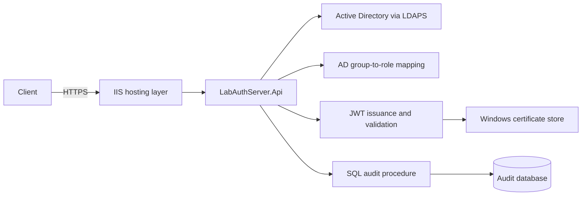

# Architecture

## Approved hard pending LDAP admission (2026-09-10)

The existing singleton semaphore now has a bounded incomplete-wait set guarded by a short admission lock. Active permits remain separate from MaxPendingLdapWaiters (default 16, range 1-128). ILdapConcurrencyLimiter returns an Application LdapAdmissionResult owning either its permit lease or the existing DirectoryFailure shape. ResourceExhausted is a distinct bounded failure with a generic 503, handled by AuthController before authentication and audited through the existing mechanism. No separate queue, worker, dependency or deadline system was introduced. Native ownership and the four-layer dependency direction are unchanged. [Algorithm, race/cleanup semantics and closure evidence](plans/Phase-2/Phase-2A-Hard-Pending-Waiter-Cap.md).

LabAuthServer is a four-layer ASP.NET Core API for Active Directory authentication, JWT issuance, role-based authorization, and SQL audit persistence.

## Layers

- `LabAuthServer.Domain` contains domain-level constants and rules.
- `LabAuthServer.Application` contains DTOs, interfaces, token orchestration, roles, policies, and audit contracts.
- `LabAuthServer.Infrastructure` contains LDAP/AD, DPAPI, group mapping, signing-key, and SQL implementations.
- `LabAuthServer.Api` contains controllers, dependency injection, middleware, authentication, authorization, and endpoint composition.

The dependency direction is `Domain <- Application <- Infrastructure <- Api`.

## Request pipeline

`Program.cs` registers ProblemDetails, controllers, validated Active Directory options, validated token and authorization options, SQL audit services, and middleware. The default ASP.NET Core host filter precedes the explicit pipeline. Requests then pass through API response-header policy, global exception handling, correlation, HTTPS redirection, routing, aggregate-header and endpoint-specific body limits, login rate limiting, Authorization-size enforcement, JWT authentication, authorization auditing, and authorization. Login body limits are applied after routing so endpoint metadata is available, but before model binding and authentication.

The login endpoint accepts at most 8192 UTF-8 request-body bytes. The body is read into a bounded buffer of at most 8193 bytes so declared and streamed/chunked lengths use the same 413 boundary without truncation. The general decoded request envelope is limited to 16128 bytes, counting the UTF-8 request target plus each header name, field separators, value, and duplicate-value comma separator. These application limits do not change IIS or HTTP.sys machine-wide limits.

The current API surface is:

- `GET /api/v1/health` — anonymous application liveness response.
- `POST /api/v1/auth/login` — anonymous HTTPS-only login and token issuance.
- `GET /api/v1/protected` — Reader-policy protected resource.

## External boundaries

- Active Directory is accessed with LDAPv3 over LDAPS on TCP 636.
- LDAP service-account credentials are loaded through the Windows DPAPI-backed provider.
- JWT signing uses an RSA certificate from the configured Windows certificate store.
- Audit events are written through `Audit.usp_WriteAuditEvent` using typed SQL parameters.

No refresh-token store, user database, MFA provider, federation provider, or audit-retention job is implemented.

## Security Slice 2 response boundary

The centralized outer response middleware registers OnStarting for `/api` paths, including health and early application failures. It sets no-store, nosniff and DENY without changing endpoint or exception contracts; callbacks ensure one final policy after downstream header assignments. HostFiltering remains outside this pipeline, accepts only `DC01.lab.local` and rejects empty hosts. IIS-native and host-filter rejections are separate boundaries. No HTML UI, trusted proxy or HSTS behavior is introduced. See [Security Slice 2](plans/Phase-2/Phase-2A-Security-Slice-2.md); source validation is complete and deployment is pending.

## Phase 2A LDAP failure classification (source only)

AuthenticationResult is now immutable and reused by the Infrastructure authentication client. DirectoryFailure carries bounded category/stage/reason and an optional explicitly sourced numeric code; fixed safe messages are derived from category. GroupLookupResult distinguishes complete successful membership (including zero groups) from failure. AuthController maps application outcomes without LDAP-library exception knowledge and stops before role mapping/signing on failed lookup.

ILdapConnectionFactory/ILdapConnection form a narrow Infrastructure-only seam over the existing synchronous LDAP provider. The service-account search -> submitted-UPN bind sequence, separate service-account group query, ConnectionTimeout, Task.Run scheduling and disposal registrations remain. No deadline, cancellation redesign, concurrency or retry mechanism was added. See [the implemented classification design](plans/Phase-2/Phase-2A-LDAP-Failure-Classification.md).

## Cooperative authentication operation (source only)

The classification slice above is extended by the approved [cooperative cancellation/deadline contract](plans/Phase-2/Phase-2A-LDAP-Cancellation-Deadlines.md). AuthController owns one Application AuthenticationOperation, explicitly shared through existing authentication/client/group interfaces. It records origin and stage and supplies a combined token. Each native stage is checked before/after execution; a late result cannot advance authentication. LDAP connection cancellation-disposal callbacks are removed; the existing synchronous provider bridge and connection cleanup remain awaited. RoleMapping and TokenIssuance stages cover post-LDAP work. No new layer dependency, package, concurrency limiter, queue or detached worker is introduced. Successful login is accepted after token issuance within budget, before best-effort audit/HTTP delivery. Immediate native interruption and hard response latency are not guaranteed.

## Login LDAP concurrency admission (source only)

AuthController now acquires the singleton ILdapConcurrencyLimiter once for identity and group lookup, retaining the lease through both sequences and native cleanup. The permit is released before mapping/signing/audit; no nested per-bind/search acquisition occurs. Infrastructure implements the gate with SemaphoreSlim and an idempotent lease; the existing Application AuthenticationOperation supplies the only deadline/origin signal. ConcurrencyWait is appended to stages. The sole public LDAP route retains its existing shared 10/minute admission policy. Low-level helpers are not globally intercepted: future endpoints/jobs must explicitly adopt admission and waiting-resource policies. [Design, scope and native/waiter limitations](plans/Phase-2/Phase-2A-LDAP-Concurrency-Resource-Protection.md).
