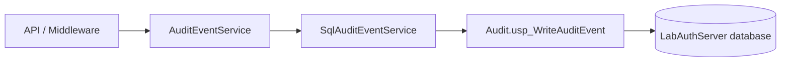

# Audit Logging

## Overview

LabAuthServer persists approved operational events to SQL Server through a repository layer and a stored procedure. The audit architecture is:

- ASP.NET Core application service
- infrastructure SQL repository
- `Audit.usp_WriteAuditEvent`
- SQL Server `LabAuthServer` database

This is the durable event path used for authentication, authorization, and unhandled-exception records.

## Audit event model

The application audit contract is represented by `AuditEvent` and uses the approved event codes in `AuditEventTypes`.

Implemented event types:

- `AUTH_LOGIN_SUCCESS`
- `AUTH_LOGIN_FAILURE`
- `AUTH_LDAP_FAILURE`
- `AUTHZ_ACCESS_GRANTED`
- `AUTHZ_ACCESS_DENIED`
- `SEC_INVALID_TOKEN`
- `SEC_EXPIRED_TOKEN`
- `SEC_INVALID_SIGNATURE`
- `SEC_INVALID_ISSUER`
- `SEC_INVALID_AUDIENCE`
- `SEC_INVALID_ROLE`
- `APP_UNHANDLED_EXCEPTION`
- `APP_VALIDATION_ERROR`

The event model includes the fields required for minimal operational records:

- correlation ID
- request ID
- username / subject
- role
- endpoint
- HTTP method
- status code
- success flag
- client IP
- server name
- application version
- JSON details payload when appropriate

## Stored procedure path

The SQL repository writes audit rows through the supported procedure:

- `Audit.usp_WriteAuditEvent`

This procedure is invoked through `SqlAuditEventService` using the configured connection string and a short command timeout. The application does not issue direct table writes and does not construct dynamic SQL for audit events.

## Database permissions

The application database role is:

- `LabAuthServer_AuditWriter`

The principal used by the application is granted only the minimum required execute permission for the stored procedure. The application is not granted broad table-level write access and does not perform direct table modifications outside the approved procedure.

## Audit flow

## Operational notes

- correlation IDs are generated and propagated through the request pipeline
- access denied events are recorded when the protected endpoint returns `403`
- failed JWT validation events are recorded via the bearer authentication failure pipeline
- global exception middleware records unhandled-server errors with correlation context
- audit payloads exclude raw secrets, tokens, DPAPI contents, and certificate private keys

No retention policy, purge job, or SQL Agent scheduling is documented in the implementation because those operational controls were intentionally deferred beyond the implemented service.
