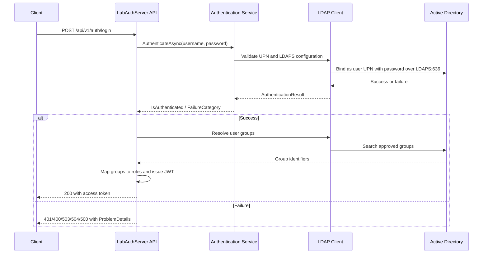

# Authentication

## Overview

LabAuthServer authenticates users through Microsoft Active Directory using LDAP over TLS/SSL on TCP port 636. The service binds using a dedicated AD service account for directory queries and uses the user-supplied principal name and password for the end-user bind.

## Trust boundaries

The application is designed to fail closed when configuration or connectivity is not valid:

- LDAPS must be enabled.
- Port 636 is required.
- LDAP protocol version 3 is required.
- The configured AD domain must match the supplied UPN domain.
- The service account credential file must exist and decrypt successfully.

If these conditions are not met, the login endpoint returns a safe failure result rather than exposing directory details.

## AD service account requirements

The operational environment must provide:

- AD domain: `lab.local`
- AD host: `DC01.lab.local`
- service account username configured in `ActiveDirectory:ServiceAccountUsername`
- service account password stored in the DPAPI-backed file `C:\ProgramData\LabAuthServer\Secrets\ldap-service-account-password.dpapi`
- Windows LocalMachine DPAPI access for the runtime identity

The application requires the service account password to be available on the server. It does not accept anonymous bind fallback for Root DSE and group lookup operations.

## User authentication flow

## LDAP configuration

The implemented configuration values are:

- `ActiveDirectory:Domain` = `lab.local`
- `ActiveDirectory:Host` = `DC01.lab.local`
- `ActiveDirectory:Port` = `636`
- `ActiveDirectory:BaseDn` = `DC=lab,DC=local`
- `ActiveDirectory:UserSearchBaseDn` = `DC=lab,DC=local`
- `ActiveDirectory:UseLdaps` = `true`
- `ActiveDirectory:ConnectionTimeout` = `00:00:10`

The runtime uses `System.DirectoryServices.Protocols` and requires LDAP v3 with a secure socket layer.

## UPN bind behavior

The implementation validates the submitted username as a UPN in the configured domain:

- format must contain exactly one `@`
- domain suffix must match `lab.local`
- empty, malformed, or non-domain UPN values fail without directory probing

This prevents the app from generating or accepting a directory-specific distinguished name and keeps the authentication contract aligned with the configured domain.

## Known operational caveats

The project history includes several real-world authentication problems:

- stale DPAPI-backed credential file
- incorrect search base or domain mismatch
- UPN bind mismatch against the configured domain
- incorrect `UseLdaps` or port-636 configuration
- LDAP service-account account not available or password file unreadable

When these occur, the service returns a generic login failure and logs a safe operational event; it does not reveal the directory error details.
