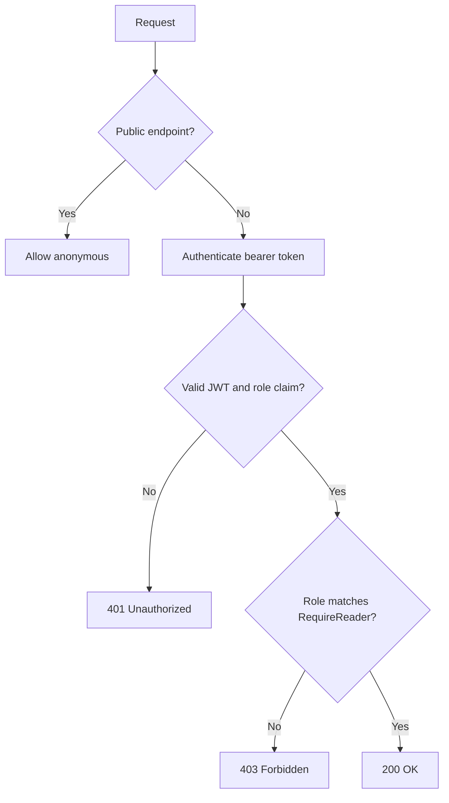

# Authorization

## Overview

Authorization in LabAuthServer is role-based and fail-closed. The application default policy requires an authenticated user and a valid token containing the expected `role` claim. The application does not expose any Operator or Administrator endpoint beyond the Reader-protected route currently implemented.

## Policy configuration

The authorization configuration is bound from the `Authorization` section and validated before startup.

The current effective settings are:

- `DefaultDeny` = `true`
- `MaximumGroupCount` = `100`
- `PublicEndpoints` = `/api/v1/health`, `/api/v1/auth/login`

The public endpoints are intentionally limited to health and login only.

## Role mapping

Approved AD group mappings:

- `GG-APP-ADMIN` -> `Administrator`
- `GG-APP-APPROVER` -> `Operator`
- `GG-APP-USER` -> `Reader`
- `GG-APP-REPORT` -> `Reader`

Role precedence:

1. `Administrator`
2. `Operator`
3. `Reader`

The mapping service normalizes group names, ignores malformed or unapproved groups, and selects the highest-precedence approved role that is present in the user’s group list.

If no approved mapping is found, the effective result is an empty role set and the request fails authorization. This is the expected fail-closed behavior.

## Protected endpoint

The only protected API route implemented is:

- `GET /api/v1/protected`

This endpoint is guarded by the `RequireReader` authorization policy.

### Expected responses

- anonymous request -> `401 Unauthorized`
- invalid or expired token -> `401 Unauthorized`
- authenticated but unauthorized -> `403 Forbidden`
- authorized Reader -> `200 OK`

The application does not implement additional protected endpoints for Operator or Administrator use.

## Policy enforcement flow

## Audit behavior for authorization outcomes

The middleware records authorization events to SQL:

- `AUTHZ_ACCESS_GRANTED` on successful Reader access
- `AUTHZ_ACCESS_DENIED` on `403` responses

The middleware does not disclose internal authorization details in the response body.
