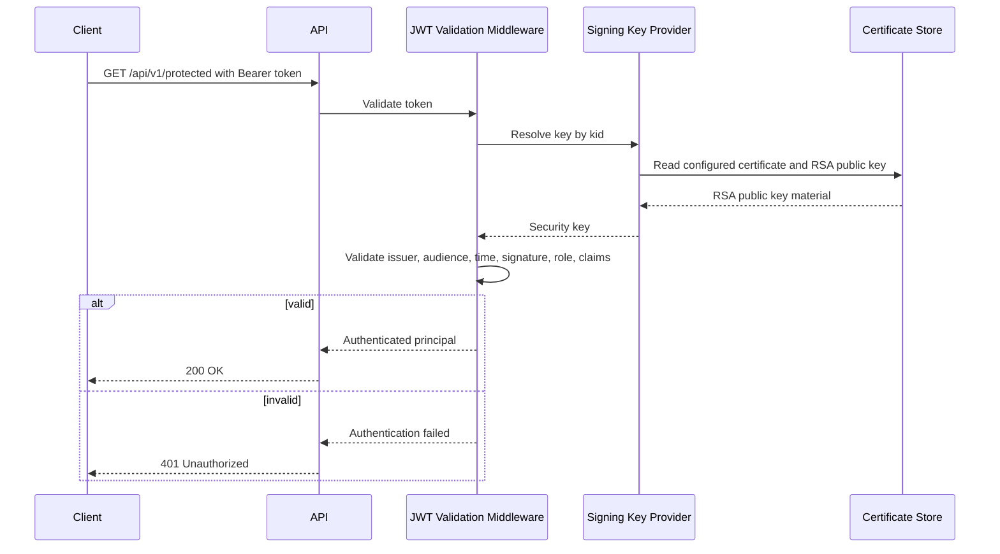

# JWT Architecture

## Overview

LabAuthServer issues short-lived JWT bearer access tokens after a successful LDAP login and approved group mapping. The tokens are signed with RSA and validated on every protected request.

## Token configuration

The runtime configuration is in the `Token` section and is validated at startup:

- `Issuer` = `https://DC01.lab.local`
- `Audience` = `LabAuthServer.API`
- `AccessTokenLifetime` = `01:00:00`
- `ClockSkew` = `00:05:00`
- `SigningAlgorithm` = `RS256`
- `ActiveKeyId` = `development-key-1`
- `SigningCertificateStoreLocation` = `LocalMachine`
- `SigningCertificateStoreName` = `My`
- `SigningCertificateThumbprint` = configured certificate thumbprint
- `SigningKeyStoreReference` = certificate store reference only
- `MaximumClaimSize` = `4096`
- `MaximumTokenSize` = `16384`

The application explicitly validates the signing algorithm before accepting tokens and requires an approved RSA-compatible algorithm.

## Signing model

The JWT signing keys come from the Windows certificate store, not from source-controlled key material.

The implementation uses:

- certificate-backed RSA private keys
- `kid` in JWT header
- `IProtectedSigningKeyProvider` abstraction
- `CertificateSigningKeyProvider` resolution from the Windows certificate store

The key provider resolves the active or approved previous key by key identifier and rejects missing or unapproved certificates. Private key material is never emitted to logs, responses, or repository files.

## Required claims

The JWT contains the required claims enforced during validation:

- `iss`
- `aud`
- `sub`
- `jti`
- `iat`
- `nbf`
- `exp`
- `role`

The actual token generation uses a single role value in the `role` claim and a single `sub` subject claim. The role claim is used for policy enforcement and must be exactly one approved value.

## Validation behavior

JWT validation is configured through the bearer authentication pipeline and includes:

- HTTPS metadata required
- inbound claim mapping disabled
- issuer validation enabled
- audience validation enabled
- lifetime validation enabled
- clock skew enforced
- signed token required
- issuer signing key validation required
- `NameClaimType` = `sub`
- `RoleClaimType` = `role`
- `ValidAlgorithms` limited to `RS256`

The validation logic rejects:

- invalid issuer
- invalid audience
- expired tokens
- invalid signatures
- missing required claims
- invalid or missing `role` claim

## Fail-closed behavior

If a token fails validation or contains an invalid claim set, the service returns `401 Unauthorized` and records an auditable failure classification. The API does not downgrade to insecure anonymous access or accept non-RS256 token types.

## JWT request/validation flow

